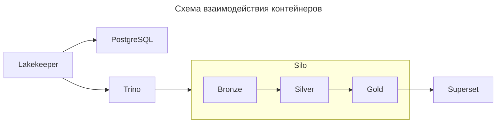

# Отчет по практической работе №1

| Поле | Значение |
| ---- | -------- |
| ФИО | Косачев Егор Сергеевич |
| Вариант / Запрос | 1 / Q3 |
| Масштаб | sf10 |

Масштаб `sf10` выбран так как на моем ноутбуке достаточно оперативной памяти и свободного места на диске, чтобы не беспокоситься о том, что таблицы не влезут. Большое количество данных для аггрегации позволит получить качественные резульататы на бенчмарках и при аналитике

## Поднятые сервисы

| Сервис | Роль в стеке | Почему именно он |
| ------ | ------------ | ---------------- |
| Silo | S3-совместимое объектное хранилище (физически содержит паркетники) | Используется вместо MinIO, так как последний больше недоступен (ушел с quay) |
| PostgreSQL | БД для метаданных каталога | Привычная SQL база данных |
| Lakekeeper | REST каталог метаданных таблиц | Качественное open-source решение |
| Trino | SQL-движок, прослойка между Lakekeeper и Silo | Быстрое и простое приложение с открытыми исходниками |
| Superset | Собирает BI-отчеты из данных Gold | Можно быстро собрать несколько графиков без кода |

### Как поднимал стек